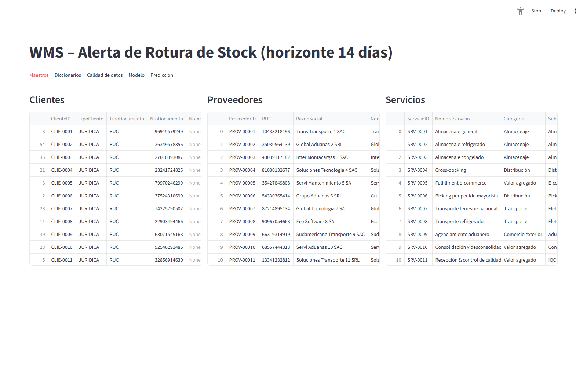
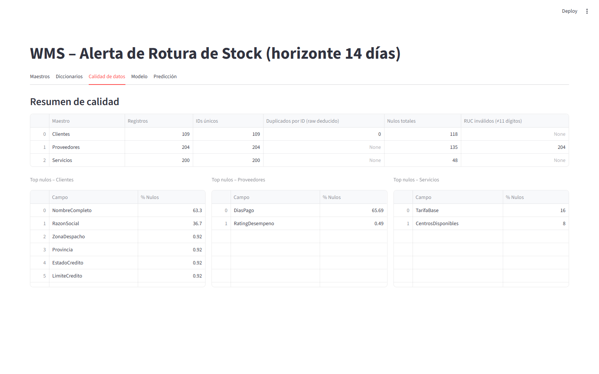
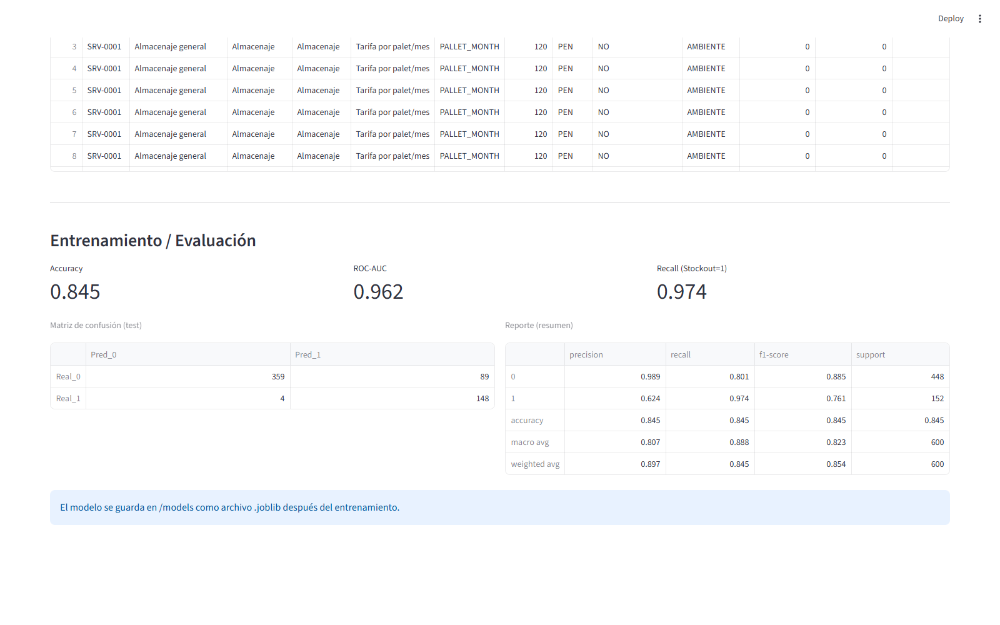
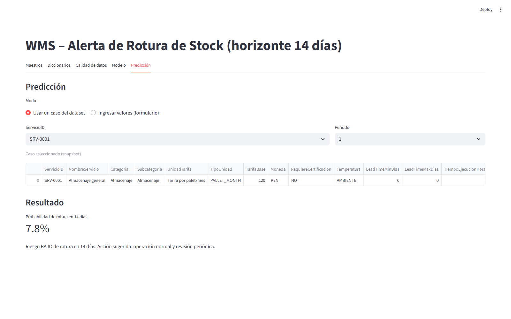
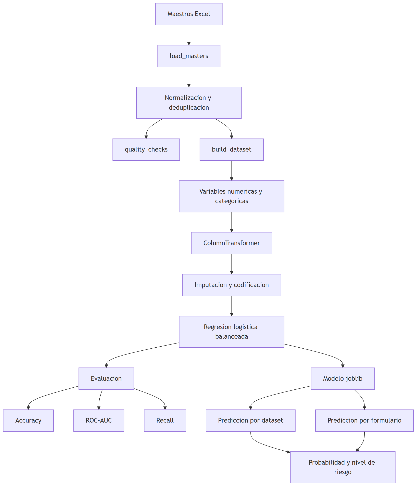
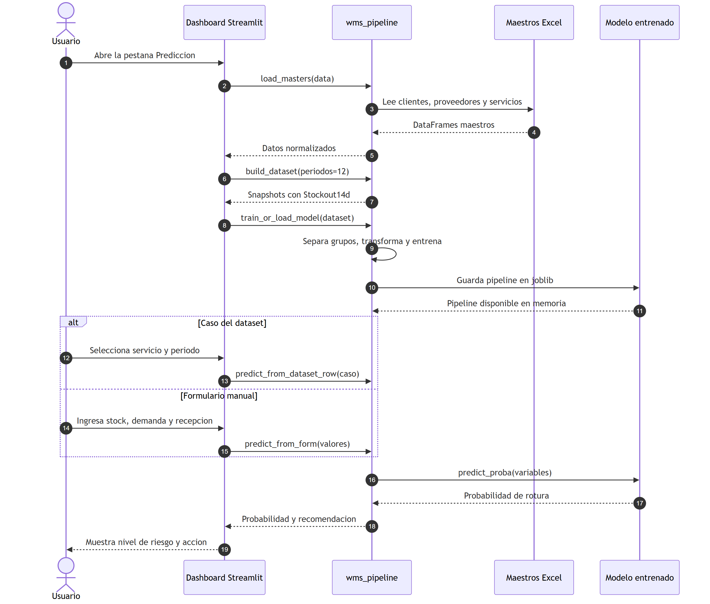

# WMS — Predicción de Rotura de Stock

Sistema de Business Analytics y machine learning que estima la probabilidad de una rotura de stock con un horizonte operativo de 14 días. Integra maestros de clientes, proveedores y servicios, controles de calidad, generación de datos transaccionales, entrenamiento de una regresión logística y un dashboard interactivo en Streamlit.

## Dashboard

### Maestros de datos

La primera vista permite explorar en paralelo los maestros normalizados de clientes, proveedores y servicios.

<p align="center">
  
</p>

### Calidad de datos

El dashboard muestra registros, IDs únicos, duplicados, valores nulos y validación de RUC, además de los campos con mayor porcentaje de datos faltantes.

<p align="center">
  
</p>

### Entrenamiento y evaluación

Con doce periodos por servicio se generan 2,400 snapshots para 200 servicios. La interfaz presenta el balance de la variable objetivo, las métricas, la matriz de confusión y el reporte de clasificación.

<p align="center">
  
</p>

### Predicción

Es posible evaluar un caso generado del dataset o introducir manualmente stock, demanda, días hasta la recepción, recepción pendiente y horizonte.

<p align="center">
  
</p>

## Funcionalidades

- Lectura y normalización de tres maestros Excel.
- Eliminación de duplicados priorizando el registro más completo.
- Diccionarios de datos visibles desde el dashboard.
- Resumen de calidad y análisis de campos nulos.
- Generación configurable de 6 a 24 snapshots por servicio.
- Entrenamiento y evaluación de un pipeline de clasificación.
- Predicción desde un caso del dataset o un formulario manual.
- Recomendaciones operativas según el nivel de riesgo.
- Persistencia del modelo y las métricas dentro de `models/`.

## Datos utilizados

| Maestro | Registros | Uso principal |
| --- | ---: | --- |
| Clientes | 109 | Segmento, canal y ubicación de despacho |
| Proveedores | 204 | Lead time, tolerancia, desempeño y certificaciones |
| Servicios | 200 | Categoría, tarifa, SLA y condiciones operativas |

El dataset sintético combina estos atributos con variables operativas como `StockActual`, `RecepcionPendiente`, `DiasHastaRecepcion` y `DemandaDiariaEst`. La variable objetivo es `Stockout14d`.

## Pipeline de machine learning

<p align="center">
  
</p>

El entrenamiento aplica:

- Imputación por mediana y estandarización para variables numéricas.
- Imputación por valor frecuente y one-hot encoding para variables categóricas.
- Separación con `GroupShuffleSplit`, agrupando por `ServicioID` para evitar que un servicio aparezca simultáneamente en entrenamiento y prueba.
- Regresión logística con clases balanceadas, `C=0.5`, solver `liblinear` y umbral de clasificación `0.5`.

## Métricas incluidas

| Métrica | Valor |
| --- | ---: |
| Accuracy | 0.845 |
| ROC-AUC | 0.962 |
| Precision de rotura | 0.624 |
| Recall de rotura | 0.974 |
| F1 de rotura | 0.761 |

El recall alto prioriza detectar casi todas las posibles roturas. Como contrapartida, la precisión de `0.624` implica que parte de las alertas serán falsos positivos; esta decisión favorece la prevención de faltantes.

## Flujo de predicción

<p align="center">
  
</p>

## Niveles de riesgo

| Riesgo | Probabilidad | Acción sugerida |
| --- | ---: | --- |
| Alto | `>= 70%` | Reabastecimiento inmediato y priorización de recepción |
| Medio | `40%–69.9%` | Monitoreo diario y validación de recepción pendiente |
| Bajo | `< 40%` | Operación normal y revisión periódica |

## Tecnologías

- Python 3.9+
- Streamlit 1.37.1
- Pandas 2.2.2
- Scikit-learn 1.5.1
- NumPy 2.0.1
- OpenPyXL 3.1.5
- Joblib 1.4.2

## Estructura del proyecto

```text
rotura_stock/
|-- data/
|   |-- maestro_clientes.xlsx
|   |-- maestro_proveedores.xlsx
|   `-- maestro_servicios.xlsx
|-- models/
|   |-- stockout14d_logreg.joblib
|   `-- metrics.json
|-- scripts/
|   `-- train_model.py
|-- docs/
|   |-- diagrams/
|   `-- screenshots/
|-- app.py
|-- wms_pipeline.py
|-- requirements.txt
|-- DOCUMENTACION_MODELO.md
|-- EXPLICACION_PREDICCION.md
|-- MODELO_MATEMATICO.md
`-- README.md
```

## Instalación

```bash
git clone https://github.com/AnthonyErazo/rotura_stock.git
cd rotura_stock
python -m venv .venv
```

Activa el entorno virtual.

En Windows:

```powershell
.venv\Scripts\Activate.ps1
```

En Linux o macOS:

```bash
source .venv/bin/activate
```

Instala las dependencias:

```bash
pip install -r requirements.txt
```

## Ejecución

```bash
streamlit run app.py
```

El dashboard estará disponible normalmente en [http://localhost:8501](http://localhost:8501).

Para entrenar el modelo sin iniciar la interfaz:

```bash
python scripts/train_model.py
```

## Comportamiento actual del modelo

El repositorio incluye un modelo serializado, pero `train_or_load_model()` actualmente vuelve a entrenar la regresión cada vez que es invocada y sobrescribe `models/stockout14d_logreg.joblib` y `models/metrics.json`. Por ello, abrir las pestañas **Modelo** o **Predicción** puede regenerar esos artefactos.

## Documentación adicional

- [Documentación del modelo](DOCUMENTACION_MODELO.md): arquitectura, variables, métricas y aplicación TO-BE.
- [Explicación de la predicción](EXPLICACION_PREDICCION.md): uso de los dos modos y toma de decisiones.
- [Modelo matemático](MODELO_MATEMATICO.md): fundamentos, fórmulas y proceso de entrenamiento.

## Limitaciones

- El dataset transaccional se genera de forma sintética a partir de los maestros incluidos.
- Las métricas describen esa generación de datos y no garantizan el mismo rendimiento con información productiva.
- No existe conexión en tiempo real con un ERP o WMS operacional.
- Los umbrales de riesgo son reglas de negocio fijas y deben calibrarse antes de un despliegue real.

---

Última actualización del proyecto: **14 de diciembre de 2025**.
